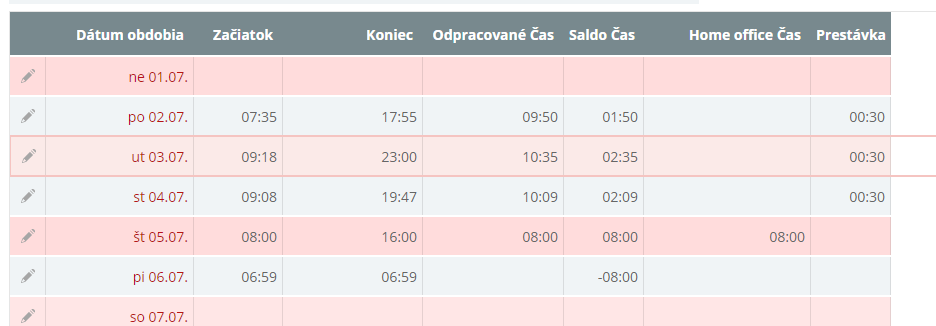

## Denna dochadzka a saldo

1. Nainstaluj TamperMonkey chrome extension
2. Vytvor novy script, placni tam toto:
```javascript
    // ==UserScript==
    // @name       dochadzka
    // @namespace  http://dodo.info/
    // @version    0.1
    // @description  compute saldo sum for day and other good stuff
    // @include *agenda.aspx*
    // @copyright  2017+, Dodo
    // @grant        none
    // @require https://raw.githubusercontent.com/mcsdodo/dochadzka/master/dochadzka.js
    // ==/UserScript==

    (function() {})();
```
2. Nastav si kompatibilne zobrazenie: Moja Dochadzka / Zobrazenie / Ulozene Zobrazenia / TamperMonkeyCompliant. Poradie stlpcov je podstatne!

3. Enjoy!
